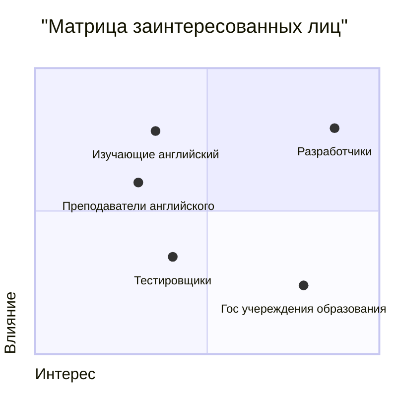

```mermaid
%%{init: {"quadrantChart": {"chartWidth": 400, "chartHeight": 400, "titlePadding": 20, "quadrantPadding": 10, "pointTextPadding": 20} }}%%
quadrantChart
    title "Матрица заинтересованных лиц"
    x-axis "Интерес"
    y-axis "Влияние"
    "Преподаватели английского": [0.3, 0.6]
    "Разработчики": [0.87, 0.79]
    "Гос учереждения образования": [0.78, 0.24]
    "Тестировщики": [0.40, 0.34]
    "Изучающие английский": [0.35, 0.78]
```
